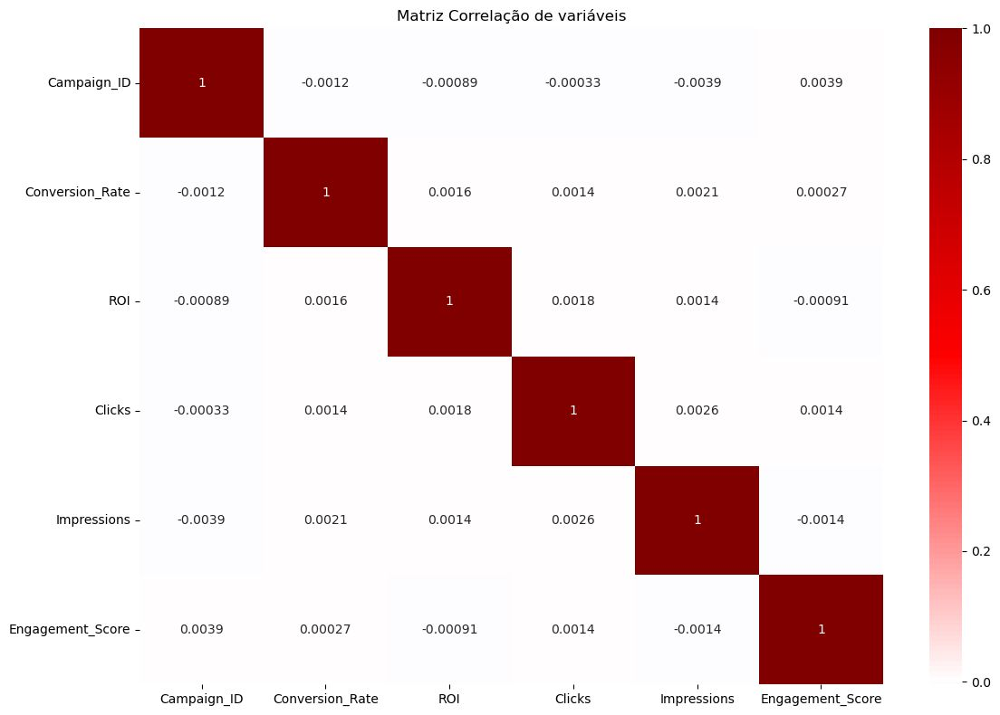
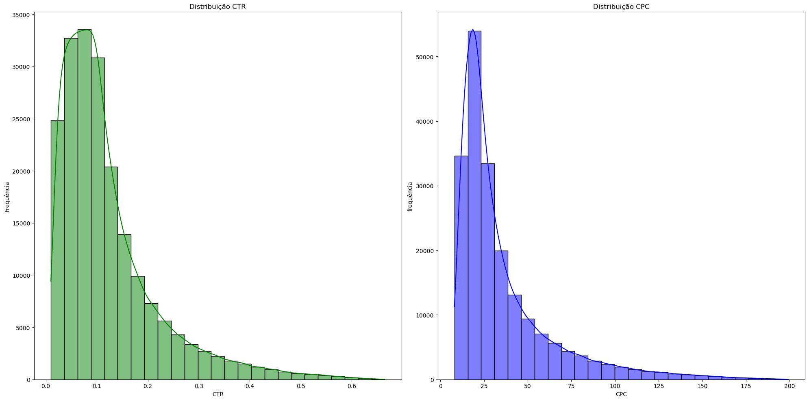
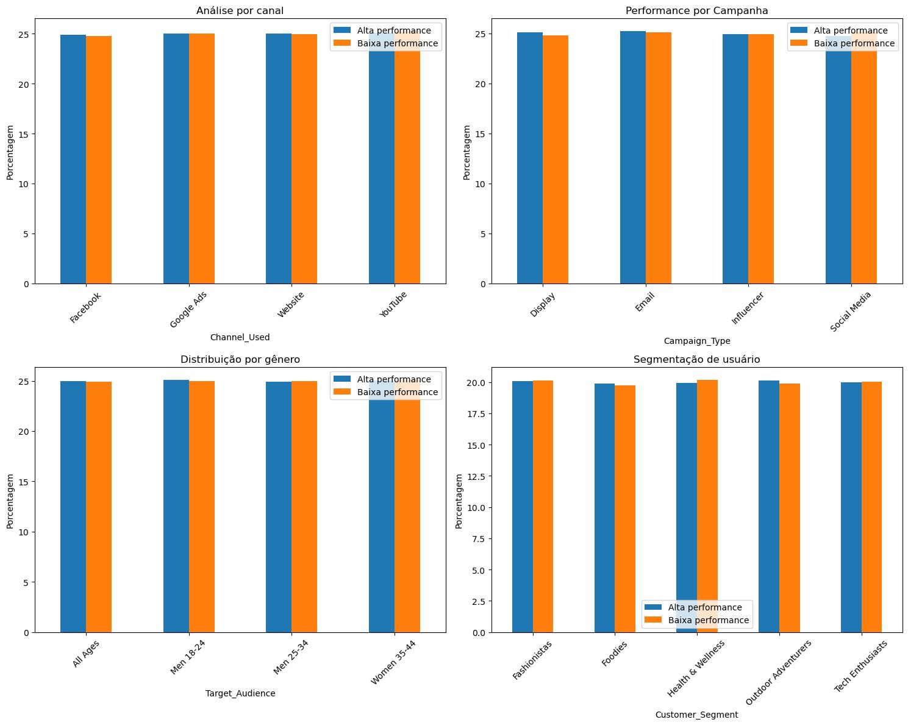

PT -  O objetivo foi aplicar conceitos de estatística e análise exploratória para identificar padrões de desempenho e gerar insights a partir dos dados.

### Etapas da análise
• Limpeza e tratamento dos dados com Pandas
• Estatística descritiva (média, mediana e desvio padrão)
• Criação de métricas de marketing como CTR (Click Through Rate), CPC (Custo por Clique) e ROI
• Visualização de dados e análise de performance

### Principais análises realizadas 

**Matriz de Correlação de Pearson**
Utilizada para avaliar a  relação linear entre as variáveis numéricas dos dados. A análise indicou correlações fracas na maior parte das métricas.

**Distribuição de CTR e CPC**:
Por meio de histogramas, foi possível observar a distribuição dessas métricas entre as campanhas. Os resultados mostraram uma assimetria à direita, indicando que a maioria das campanhas apresentava valores mais baixos. 

**Análise de ROI**:
As campanhas foram segmentadas por quartis de ROI para comparação entre grupos de alta e baixa performance.

Este projeto reforçou a importância da análise exploratória de dados para transformar informações brutas em insights que podem apoiar decisões de negócio e estratégias de marketing.

___

EN - The goal of this project was to apply **statistical concepts** and **exploratory data analysis (EDA)** to identify performance patterns and generate insights from marketing data.

### Analysis steps

* Cleaned and prepared the data using **Pandas**
* Performed **descriptive statistics** (mean, median, and standard deviation)
* Created marketing metrics such as **CTR (Click-Through Rate), CPC (Cost per Click), and ROI**
* Built visualizations to analyze campaign performance

### Key analyses

**Pearson Correlation Matrix**
Used to evaluate the linear relationship between numerical variables. The analysis showed mostly weak correlations between the marketing metrics.

**CTR and CPC Distribution**
Used histograms to analyze the distribution of these metrics across campaigns. The results showed a right-skewed distribution, indicating that most campaigns had lower CTR and CPC values.

**ROI Analysis**
Segmented campaigns into ROI quartiles to compare high- and low-performing campaigns.

This project reinforced the importance of **exploratory data analysis** in transforming raw data into actionable insights that support business decisions and marketing strategies.

<h2>Matriz de Correlação de Pearson</h2>

<h2>Distribuição das Métricas de Marketing</h2>

<h2>Segmentação por Performance</h2>

